<div align="center">


# Giving Hermes Agent the web, safely: DuckDuckGo search, a sandboxed browser, a toolbox image, GPU fix and egress filtering


*A local Hermes agent said it had no web search. It was right. This repo documents why, how it was fixed without any
paid service or API key, and what grew from it: a browser that runs inside the Docker sandbox, a CLI toolbox image, a
GPU fix that survives systemd reloads, hardening flags and egress filtering. It also records what was tested, what
was wrong along the way, and what is still open.*

</div>

---

## Table of contents
1. [Current state](#current-state)
2. [TL;DR setup checklist](#tldr-setup-checklist)
3. [The question](#the-question)
4. [Diagnosis](#diagnosis)
5. [How toolsets resolve](#how-toolsets-resolve)
6. [The fix](#the-fix)
7. [Request path](#request-path)
8. [Gotchas](#gotchas)
9. [Limits](#limits)
10. [Alternatives](#alternatives)
11. [Verification status](#verification-status)
12. [Troubleshooting](#troubleshooting)
13. [Browser access](#browser-access)
14. [Corrections and follow-up findings](#corrections-and-follow-up-findings)
15. [Sandbox upgrade](#sandbox-upgrade)
16. [Lessons learned](#lessons-learned)
17. [Decision log](#decision-log)
18. [Open items](#open-items)
19. [Runbook and changelog](#runbook-and-changelog)
20. [Diagram index](#diagram-index)
21. [Repo layout](#repo-layout)

## Current state

Last updated 2026-10-06. Every "verified" entry names the evidence; nothing is rated verified on the model's say-so.

| Capability | Status | How verified |
|---|---|---|
| `web_search` | working, real DuckDuckGo | Hermes `agent.log`: `DDGS search ...: 7 results` |
| `web_extract` | working via Keenable's free tier (third party fetches the page) | example.com returned 156 characters |
| `terminal` tool | working in `hermes-sandbox:desktop-tools` | `docker exec` checks; real Hermes runs |
| Browser | working inside the sandbox | `browser_navigate` 2.71 s and `browser_snapshot` 0.83 s in the log; Xvnc, xfwm4, xfdesktop running |
| Domain blocklist | enforced for browser navigation only | `mail.google.com` blocked in 0.06 s; `web_extract` still fetched it |
| GPUs in the sandbox | 2 visible, survive `daemon-reload` | control container (`--gpus` only) lost them, sandbox kept them |
| Egress filter | private ranges and metadata blocked, internet and Ollama open | probes inside the real container; survives `docker restart` |
| Brave search | not configured (deferred by the user) | n/a |
| Full machine reboot | **not tested** | n/a |

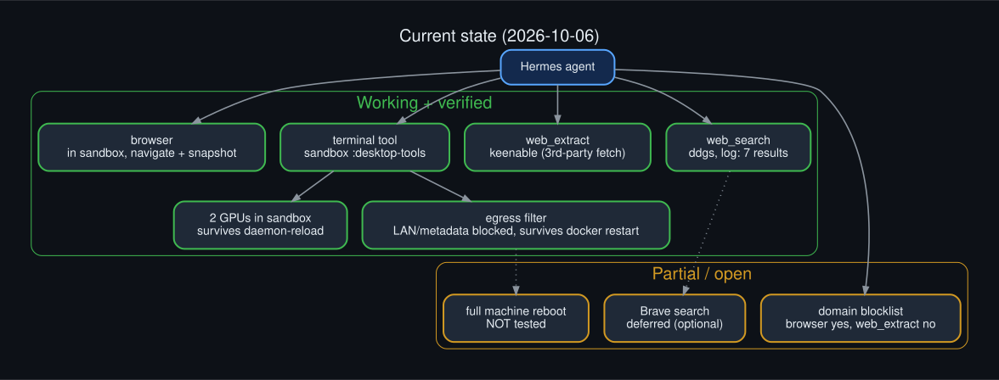

Architecture in one picture: search and extract run on the host; the terminal and the browser run in a hardened
Docker sandbox on its own network.


## TL;DR setup checklist

| # | What | Where |
|---|---|---|
| 1 | `hermes tools post-setup ddgs` (installs `ddgs` into Hermes's managed env, **not** plain pip) | shell |
| 2 | Remove `web` and `browser` from `agent.disabled_toolsets`; add `web` and `browser` to `platform_toolsets.cli` | `~/.hermes/config.yaml` |
| 3 | `web.search_backend: ddgs`, `web.extract_backend: keenable` | `config.yaml` |
| 4 | `browser.backend: 'off'` (stops the Browser Use CLI mode hiding `browser_*`) | `config.yaml` |
| 5 | Build `hermes-sandbox:desktop-tools` (`sandbox/Dockerfile.*`) and set `terminal.docker_image` | docker + `config.yaml` |
| 6 | GPU: keep `--gpus=all` and add explicit `--device=/dev/nvidia*` to `terminal.docker_extra_args` | `config.yaml` |
| 7 | Hardening: `--security-opt=no-new-privileges`, `--pids-limit=512` | `config.yaml` |
| 8 | Egress: `docker network create hermes-sbx`, install `sandbox/egress/*`, UFW allow 11434 from the subnet, `--network=hermes-sbx` | host + `config.yaml` |
| 9 | Optional: `security.website_blocklist` | `config.yaml` |
| 10 | Recreate the sandbox container, then verify with the [runbook](RUNBOOK.md) | shell |

No API key, no account, no cost. Exact diffs: [`config-diff.md`](config-diff.md).

## The question

> "For the running hermes instance on this machine the agent reports that it doesn't have web search
> functionality/accessibility? Is that true?"

## Diagnosis

It was true, and it was a configuration state rather than a bug. Three independent things pointed the same way:

1. `agent.disabled_toolsets` listed `web`, `search`, `x_search` and `browser`.
2. `platform_toolsets.cli` was `file, skills, terminal, vision`, with no web entry.
3. Every search provider key in `~/.hermes/.env` (Exa, Parallel, Firecrawl) was a commented-out template line.


## How toolsets resolve

`disabled_toolsets` is a strict deny list: a toolset named there is subtracted from what the platform asks for,
so adding `web` to the CLI toolsets alone would not have been enough.

- `web` = `web_search` + `web_extract`
- `search` = `web_search` only


## The fix

Two changes: one package, one config edit.

```bash
# 1. install ddgs into the env Hermes actually loads (see Gotchas and Corrections)
hermes tools post-setup ddgs
# NOT: pip install into the base runtime python - Hermes cannot see it (found the hard way)

# 2. back up, then edit config
cp ~/.hermes/config.yaml ~/.hermes/config.yaml.bak-$(date +%s)
```

```yaml
agent:
  disabled_toolsets:      # 'web' and 'search' removed from this list
    - x_search            # ...others unchanged
platform_toolsets:
  cli:
    - file
    - web                 # added
    - skills
    - terminal
    - vision
web:
  search_backend: ddgs    # added
```


`hermes tools list` afterwards reports `web  Web Search & Scraping` as enabled.

## Request path

Hermes's `ddgs` plugin (`plugins/web/ddgs/provider.py`) does not call the library in-process. Each search
runs in a disposable child process that the parent polls, so a hung network call can be killed.


Per the plugin's own docstring, `ddgs`/`primp` can block inside native code while holding the GIL, which
makes a thread-pool timeout impossible to enforce and can freeze Ctrl+C. The parent therefore enforces a
30 second wall-clock cap and escalates `terminate()` to `kill()` after a one second grace period.


## Gotchas

**Install into the right environment.** The `hermes` launcher runs the managed runtime Python in isolated
mode (`-I`), and `hermes_bootstrap` prepends a generation venv under `~/.hermes/installs/<id>/environments/<id>/venv`.
Packages must live there. `hermes tools post-setup ddgs` does that; a plain `pip install` into the base runtime
Python is invisible to Hermes. This repo's first version of these docs got this wrong (see Corrections).


**False positives while checking.** `import ddgs` from inside `hermes-agent/plugins/web/` appears to succeed,
because the plugin directory named `ddgs/` is importable as a namespace package from that cwd, and an import from
the *base* runtime Python succeeds too. Neither proves Hermes can load it. Check Hermes's own log for
`Web search via ddgs` followed by `DDGS search ...: N results`.

**Searching vs. the sandbox.** Web search and extract run on the host side of the agent. The Docker sandbox
(`terminal.backend: docker`) hosts the `terminal` tool and, by Hermes's design, the browser too (see Browser access).


## Limits (final stack)

- **Extract is third party.** `ddgs` is search only. `web_extract` runs through Keenable's free tier, so the
  URLs the agent extracts are visible to that service.
- **Rate limits.** DuckDuckGo is reached through an unofficial scraping library and may throttle heavy use. A 30 s cap keeps
  the agent loop from hanging, and the free keyless fallback ring covers rate-limit failures.
- **Blocklist gap.** The domain blocklist is enforced for browser navigation, not for `web_extract`.
- **Egress blocks the LAN.** The sandbox cannot reach private ranges; add a narrow exception if the agent needs a LAN host.
- **Privacy.** Search queries leave the machine to DuckDuckGo, unlike a self-hosted SearXNG.
- **Browser fidelity.** Pages are driven through accessibility snapshots by a local model; see Lessons learned for how
  the model's own reports misled us.

## Alternatives

| Backend | Key? | Notes |
|---|---|---|
| `ddgs` | none | **chosen**; search only (extract via Keenable) |
| `brave-free` | `BRAVE_SEARCH_API_KEY` | optional, **deferred by the user**; free signup at brave.com/search/api, about 2k queries/month per the plugin manifest |
| `searxng` | none (self-host) | most private; needs a SearXNG instance |
| Exa / Parallel / Firecrawl | API key | keyed vendors with extract support |

Switching is one line: `web.search_backend: brave-free` (plus the key in `~/.hermes/.env`).


## Verification status

Honest accounting (see the evidence matrix for where each claim comes from):

| Check | State |
|---|---|
| Real `ddgs` search through Hermes | done (`DDGS search ...: 7 results` in `agent.log`) |
| `web_extract` through Keenable | done (example.com content) |
| Browser navigate + snapshot in the sandbox | done |
| Browser blocklist enforcement | done (0.06 s block); not enforced for `web_extract` |
| GPU in sandbox across `daemon-reload` | done (control comparison) |
| Egress policy and `docker restart` survival | done |
| Full machine reboot | **not done** |

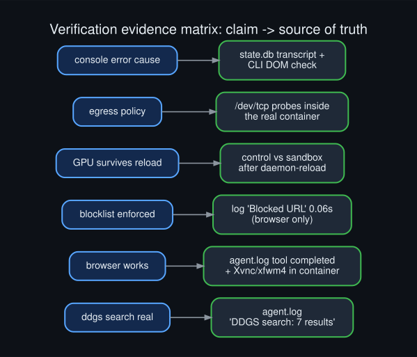


## Troubleshooting


| Symptom | Likely cause | Fix |
|---|---|---|
| Search "works" but the log says `ddgs package is not installed` | `ddgs` in the wrong Python; keyless rescue is serving | `hermes tools post-setup ddgs` |
| Timeouts or empty search results | DuckDuckGo rate limiting | wait; fallback ring covers it; or switch backend |
| Agent has only vault browser tools | Browser Use CLI mode is the default | `browser.backend: 'off'` |
| `browser_navigate`: Bot Desktop needs Xvnc... | sandbox image lacks the desktop stack | use `hermes-sandbox:desktop-tools`, recreate |
| NVML Unknown Error in the sandbox | cgroup device rule dropped after a systemd reload | recreate; keep the `--device` flags |
| Sandbox cannot reach a LAN host | egress policy | narrow allow in `hermes-sandbox-egress.sh` |
| Agent claims success without evidence | model hallucination | check `agent.log` / `docker exec` |

Full commands: [`RUNBOOK.md`](RUNBOOK.md).

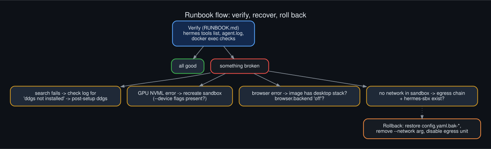

## Browser access

**Status: working, inside the Docker sandbox.** Verified in a real Hermes run: `browser_navigate` and
`browser_snapshot` completed against https://example.com, with Xvnc, xfwm4 and xfdesktop running in the container.

How it got here (the browser needed three things): the toolset enabled, the default Browser Use CLI mode turned
off, and a sandbox image that carries the desktop stack.

Four access levels exist (local, CDP attach, real profile, cloud); this setup uses the sandboxed local one:


### Config

`browser` removed from `agent.disabled_toolsets`, added to `platform_toolsets.cli`, `browser.backend: 'off'`
(without it Hermes swaps the standard `browser_*` tools for a single `browser_exec`, and the agent only saw vault
tools), and `terminal.docker_image: hermes-sandbox:desktop-tools`.


### Why the sandbox needs a desktop image

With `terminal.backend: docker`, `bot_desktop.placement: auto` puts the browser inside the sandbox, so pages the
model chooses never touch the host. Hermes refuses to start it unless the image has Xvnc, xfwm4, xfce4-panel,
xfdesktop, xfsettingsd, dbus-run-session, xauth, xdpyinfo and xprop, plus the `agent-browser` CLI and a Chromium.
The error before the image existed was: *Bot Desktop needs Xvnc, xfwm4, ... inside the terminal backend's sandbox.*

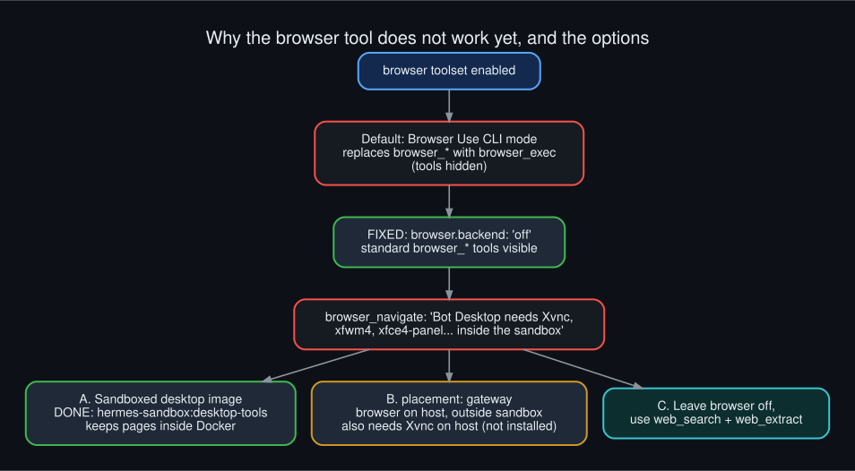

### The desktop image

[`sandbox/Dockerfile.desktop`](sandbox/Dockerfile.desktop) extends `hermes-sandbox:tools` (+0.9 GB, 9.98 GB total):
apt packages for the desktop (tigervnc, Xfce parts, dbus, x11-utils, a few Chromium libraries, fonts), the
`agent-browser` 0.26.0 binary, and the Playwright-layout Chromium 1208 at `/opt/playwright/chromium-1208`.
The two binaries were copied from `~/.hermes/tools/` into the build context; they are about 360 MB and are not
committed. The image was checked for all required binaries and for zero unresolved Chromium libraries.

```bash
# context needs assets/agent-browser and assets/chrome-linux64 (copied from ~/.hermes/tools)
docker build -t hermes-sandbox:desktop-tools -f Dockerfile.desktop .
```

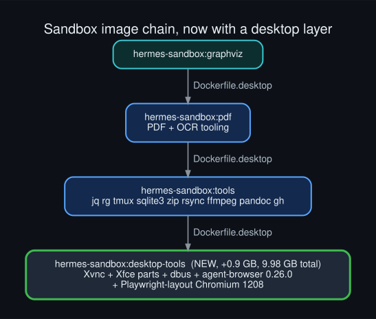
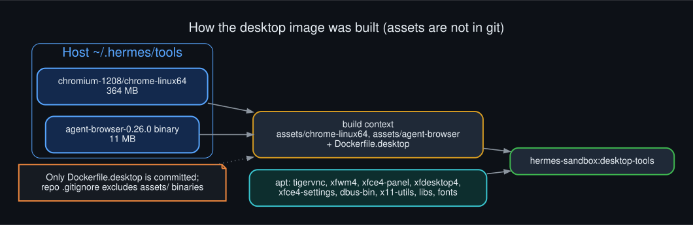
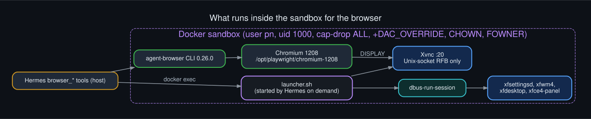

### Verification

- `agent.log`: `browser_navigate completed (2.71s)`, `browser_snapshot completed (0.83s)`.
- Container `docker exec`: `Xvnc`, `xfwm4`, `xfdesktop` running; image `hermes-sandbox:desktop-tools`; both GPUs still visible.
- Blocklist on the browser path: navigating to `mail.google.com` returned `Blocked by website policy` in 0.06 s,
  with the matched rule in the log.
- `browser_console` (page JavaScript evaluation) logged a `removeChild` TypeError on example.com. Investigated: it is
  not a bug in Hermes or the browser stack; see the next section.

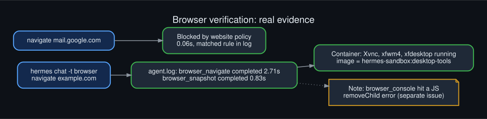

### The `browser_console` TypeError, investigated

Transcript and log evidence (Hermes `state.db` messages plus `agent.log`):

- The agent first ran `document.querySelector('h1')?.textContent`, twice; both returned `null`.
- It then ran a script that *mutates the page*: `let h = document.querySelector('h1'); document.body.removeChild(h)`.
  The error position `<anonymous>:1:53` is exactly the `removeChild(` call.
- A direct CLI check shows why `h` was `null`: today's example.com has **no `<h1>` or `<h2>`**. `body` contains a
  `STYLE`, an `svg`, six `P`, an `A` and a `SCRIPT` (the page is now a multilingual notice, not the classic heading).
  `removeChild(null)` throws precisely `TypeError: ... parameter 1 is not of type 'Node'`.
- The tool did its job: it returned `{"success": false, "error": "Evaluation error: ..."}` and the agent recovered with a
  read-only expression.

So the "issue" is the model's wrong assumption plus an unnecessary DOM-mutating script, nothing to fix in the stack.
Side observations: the agent labelled a paragraph as the page's "heading" and reported 3 console calls when it made 5,
a reminder that its self-reports need checking against logs. Hermes also wraps browser output in
`<untrusted_tool_result>` markers telling the model to treat it as data, and `browser_console` runs an evaluation
policy check before executing expressions (both seen in the code and transcript, not tested adversarially).

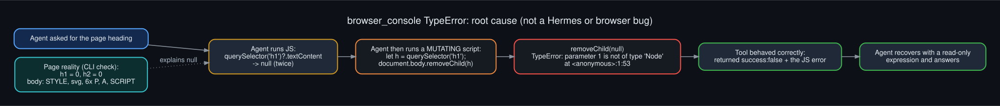

The browser is in the sandbox, so everything in the egress review below applies to it too.


## Corrections and follow-up findings

Honest list of what earlier versions of these docs got wrong, found while testing end to end:

| Earlier claim | Reality |
|---|---|
| `ddgs` installed into the managed Python and working | Installed into the *base* runtime Python, which Hermes does not load. Hermes logged `ddgs package is not installed` and the keyless rescue ring silently served the searches, so they "worked". Fixed with `hermes tools post-setup ddgs`; log now shows `DDGS search ...: 7 results`. The stray base-Python install was removed. |
| Browser runs on the host, outside the sandbox | With `terminal.backend: docker`, Hermes places the browser inside the sandbox (`placement: auto`) and refuses to run it elsewhere implicitly. |
| Browser toolset enabled = browser available | Needed `browser.backend: 'off'` plus a sandbox image with the desktop stack. Both done; browser verified working. |
| "No sudo available" (sandbox GPU section) | Passwordless sudo works; already corrected earlier. |

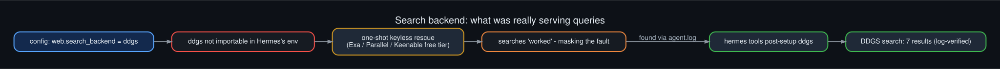

### Extract backend

`web_extract` was failing over to a one-shot rescue on every call. Pinned `web.extract_backend: keenable`
(keyless free tier; the page URL is fetched by a third party). Verified: example.com returned 156 characters of content.

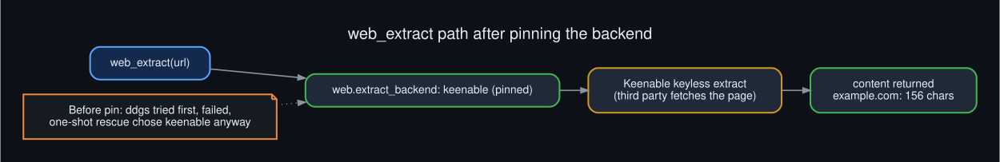

### Domain blocklist

Added `security.website_blocklist` (enabled, 8 rules: Google accounts/mail, Microsoft login/outlook, Apple ID,
PayPal). The matcher blocks them and allows others. **Coverage is partial:** the browser's navigation path enforces the
policy (live-tested: blocked in 0.06 s), but `web_extract` via the third-party
fetcher did **not** block `mail.google.com` (it returned the public landing page). The browser path was live-tested later and does block it. Private IPs and cloud-metadata
hosts are always blocked by `url_safety` regardless.

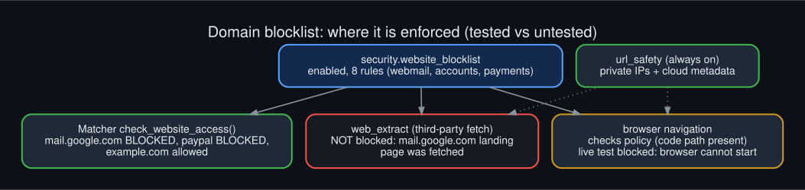

### Search fallback

`web.keyless_fallback` and `web.keyless_rescue` default to on, so a DuckDuckGo rate limit falls to the keyless
ring. Brave remains optional: it needs a free key from brave.com/search/api, which I cannot create; set
`web.search_backend: brave-free` and `BRAVE_SEARCH_API_KEY` in `~/.hermes/.env` if wanted.

### Cleanup (approved scope)

Kept the newest 3 of 14 config backups, removed 3 old Open WebUI containers and 1 exited NemoClaw container, and
removed the Open WebUI v0.7.2 and v0.11.3 images. Docker images went from 40.8 GB to 31.3 GB; the five running
containers and Open WebUI v0.11.4 (HTTPS 200) were unaffected. Side effect: older rollback backups are gone.

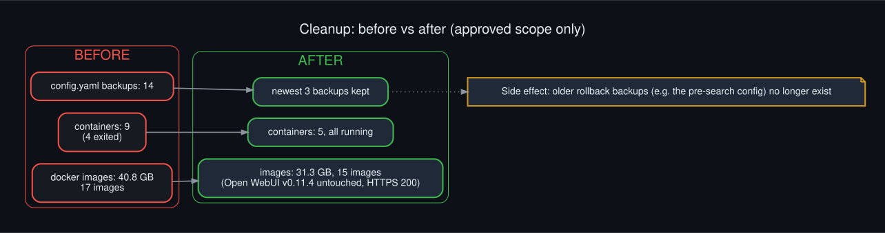

### Sandbox egress policy (applied)

Measured before the change, from inside the sandbox: internet reachable, the LAN gateway's web ports reachable, host
Ollama, Tika and Meilisearch reachable, cloud-metadata address not blocked, and the `DOCKER-USER` chain empty.

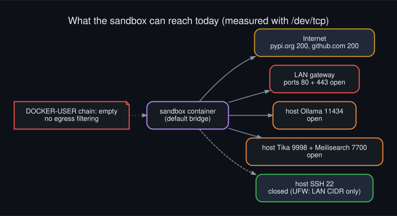

**Design:** the sandbox shares Docker's default bridge with Agent Zero, so a rule on that bridge would hit both.
Instead the sandbox moved to its own network, `hermes-sbx` (172.30.0.0/24), and the rules match only that subnet:

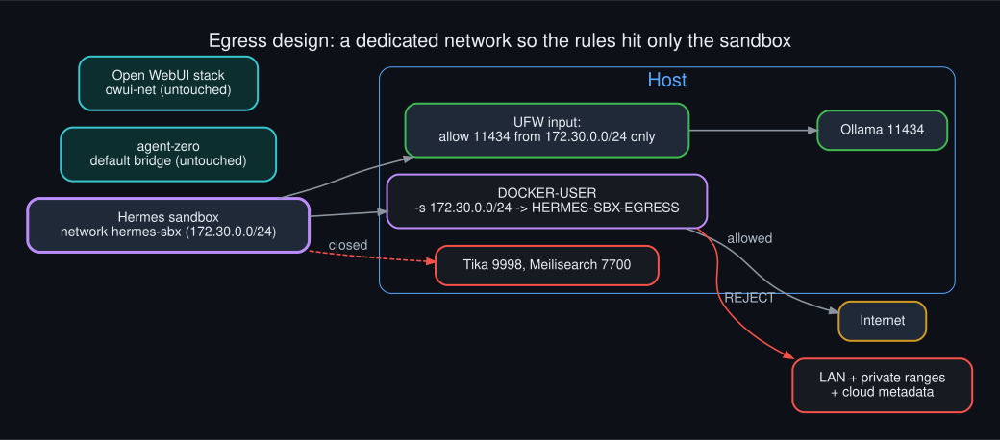

- `sandbox/egress/hermes-sandbox-egress.sh` creates a `HERMES-SBX-EGRESS` chain that REJECTs destinations in
  10/8, 172.16/12 (other containers), 192.168/16 (LAN), 169.254/16 (cloud metadata) and 100.64/10, then RETURNs, so
  the internet stays open. `DOCKER-USER` jumps to it for `-s 172.30.0.0/24`.
- `sandbox/egress/hermes-sandbox-egress.service` runs it at boot (after, and part of, `docker.service`).
- One UFW rule allows host Ollama from that subnet only (`11434/tcp`). Tika and Meilisearch are closed to the
  sandbox because their allows were on `docker0`, which the new network does not use.
- Config: `--network=hermes-sbx` added to `terminal.docker_extra_args`, then the container was recreated.
  The DNS resolvers in use are public (1.1.1.1, 8.8.8.8), so blocking private ranges does not affect name resolution.

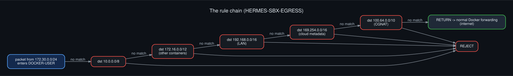
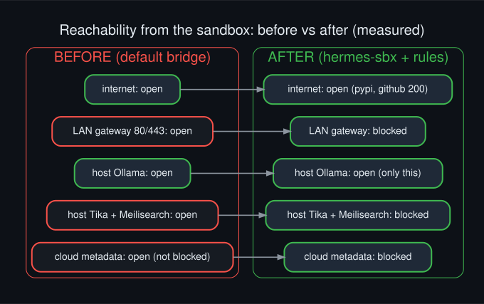

**Verified** from the real sandbox container: pypi.org and github.com return 200; the LAN gateway, cloud metadata and
Tika are blocked; Ollama answers; a Hermes run did a terminal `curl` plus browser navigate and snapshot successfully;
both GPUs are still visible; Open WebUI still returns 200; the rules survived a service restart and a `daemon-reload`.

**Docker restart test:** `sudo systemctl restart docker` (tears down and rebuilds all Docker networking). Afterwards the
`hermes-sbx` network and the `HERMES-SBX-EGRESS` chain were intact and the egress service was active; the four containers with
an `unless-stopped` policy came back (Open WebUI healthy, HTTPS 200); the sandbox, which has no restart policy, stayed
stopped until Hermes started it again on its next terminal call. Re-testing from inside it gave the same result as before:
internet 200, LAN gateway and metadata blocked, Tika blocked, Ollama open, both GPUs visible.

**Not tested:** a full machine reboot (boot ordering, UFW loading at startup), and IPv6 (the network has none configured). Proxy allowlisting by domain was not
pursued. Anything the agent legitimately needs on the LAN is now blocked by design; add a narrow allow to the chain if so.

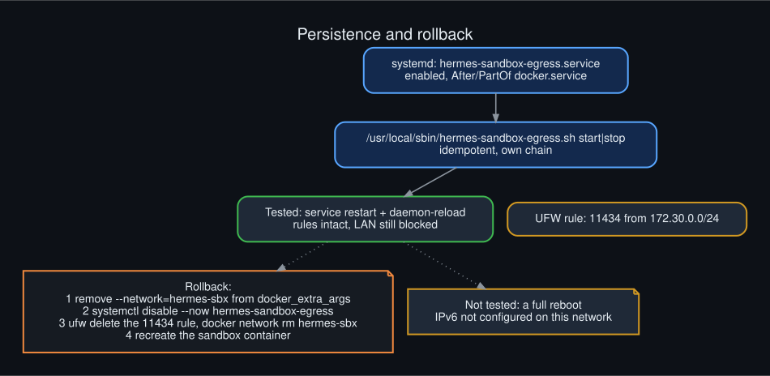

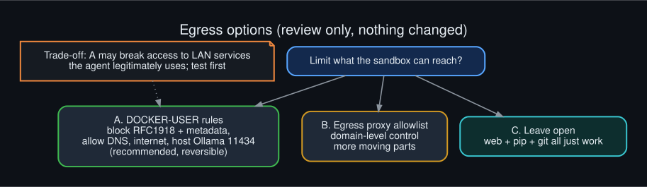

### Test ladder and capability map

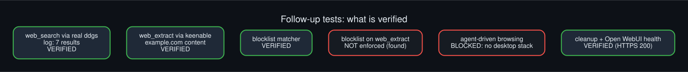
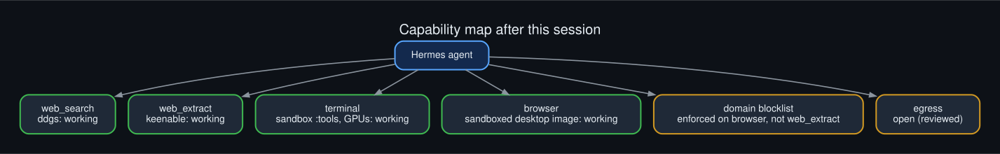

## Sandbox upgrade

Follow-up question: "what else might our hermes agent docker instance need?" A read-only survey of the
sandbox container (`hermes-5da4a7d0`, image `hermes-sandbox:pdf`) found three things worth fixing.


Web search and the browser tool run on the host; only the `terminal` tool runs in Docker.

### 1. CLI toolbox image

Missing from the image: `jq`, `ripgrep`, `tmux`, `sqlite3`, `zip`, `rsync`, `ffmpeg`, `pandoc`, `gh`.
They are now baked into a new image layer, [`sandbox/Dockerfile.tools`](sandbox/Dockerfile.tools), so they survive
container recreation (ad-hoc installs into a running container do not).

```bash
docker build -t hermes-sandbox:tools -f Dockerfile.tools .   # then terminal.docker_image: hermes-sandbox:tools
```

`libreoffice` and `chromium` were skipped on purpose, since the browser tool runs on the host.


### 2. GPU silently dead inside the long-running container

Symptom: `nvidia-smi` printed `Failed to initialize NVML: Unknown Error` and `torch.cuda.is_available()` was
`False`, although `--gpus=all` was configured and `/dev/nvidia*` nodes existed. A **fresh** container with
`--gpus=all` worked (2 GPUs, CUDA True), so the host setup was fine. Docker here uses the systemd cgroup driver
(cgroup v2) and two systemd reloads had happened since the container started, which is the known way to lose
device access. The cause was then **confirmed by reproduction**: a control container started with `--gpus=all` only lost the GPU
(same NVML Unknown Error) immediately after one `sudo systemctl daemon-reload`.


Fix: keep `--gpus=all` and also pass explicit device flags so the access is part of the container's own config:

```yaml
terminal:
  docker_extra_args:
    - --gpus=all
    - --device=/dev/nvidia0
    - --device=/dev/nvidia1
    - --device=/dev/nvidiactl
    - --device=/dev/nvidia-uvm
    - --device=/dev/nvidia-uvm-tools
```


**Tested across a reload:** with the sandbox and a `--gpus=all`-only control container both running, one
`sudo systemctl daemon-reload` left the sandbox with both GPUs and torch CUDA True, while the control lost the GPU
(`Failed to initialize NVML: Unknown Error`). One reload, one run; it is a single observation, not a soak test.


### 3. Hardening

| Control | State |
|---|---|
| cap-drop ALL (Hermes re-adds DAC_OVERRIDE, CHOWN, FOWNER), non-root uid 1000, 4 GB / 2 CPU | already on |
| `--security-opt=no-new-privileges` | **added** (Hermes also sets it, so it appears twice; harmless) |
| `--pids-limit=512` | **added** |
| network egress | **now filtered**: private ranges and metadata blocked, internet open (see Corrections section) |
| rw mounts of `/workspace` and `sandbox_ssh` | left as is: this is the real blast radius |
| writable rootfs, runc runtime | left as is |


### Applying it: recreating the container

The old container was stopped and removed; Hermes recreated it from config on its next terminal call.
Everything was dry-run first with a throwaway `docker run` using the same flags.


### Verification, and a warning about self-reports

Checked with `docker exec` and `docker inspect` on the new container: both GPUs listed, torch CUDA True,
`jq 1.7`, `ripgrep 14.1.1`, `/workspace` writable, PidsLimit 512, no-new-privileges set, 5 device nodes.

A first check through `hermes chat -q` made **zero tool calls** and returned invented output (for example
`jq 1.7.1` and `Total GPUs: 1`). It was discarded. A retry with `-t terminal` made real calls. Verify with
Docker, not the model's own report.


## Lessons learned

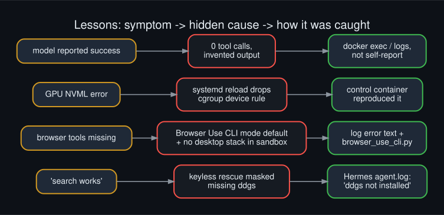

1. **A fallback can hide a fault.** The keyless rescue ring made search look healthy while `ddgs` was not even loadable.
   Read the component's own log, not just the outcome.
2. **Where a package lives matters.** Hermes runs an isolated managed environment; a plain `pip install` elsewhere is invisible.
3. **Defaults change tool surfaces.** Browser Use CLI mode silently replaced the standard browser tools.
4. **Sandboxed placement is deliberate.** Hermes puts the browser in the sandbox when the terminal is Docker; the fix is to
   give the sandbox what it needs, not to move the browser out.
5. **Reproduce before you blame.** A control container proved the GPU loss came from the cgroup behaviour, not the setup.
6. **Models mis-report.** One run made zero tool calls and returned invented output; another miscounted its own calls.
   Verify with logs and `docker exec`.
7. **Check your own claims.** Several statements in earlier versions of these docs were wrong and were corrected
   (see the Corrections table).

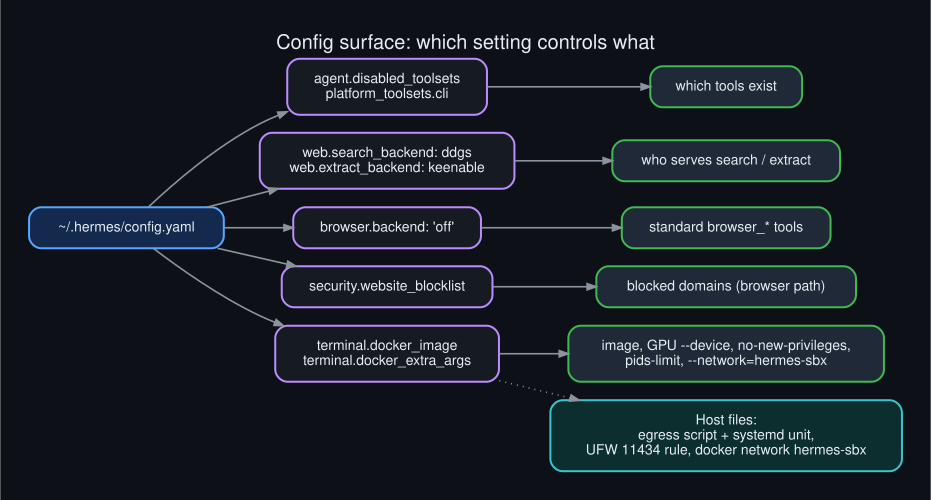
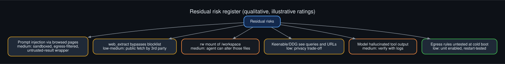

## Decision log

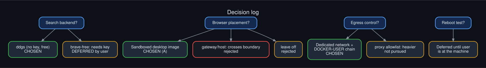

| Decision | Chosen | Why |
|---|---|---|
| Search backend | DuckDuckGo (`ddgs`) | no key, no cost |
| Brave | deferred by the user | optional; needs a free key |
| Browser placement | sandboxed desktop image | keeps pages the model chooses inside Docker |
| Egress control | dedicated network + `DOCKER-USER` chain | scopes the rules to the Hermes sandbox only |
| Cleanup | approved scope only | keep newest 3 config backups, old Open WebUI and NemoClaw leftovers |
| Machine reboot test | deferred | user present first; prior boot-hang history on this host |

## Open items

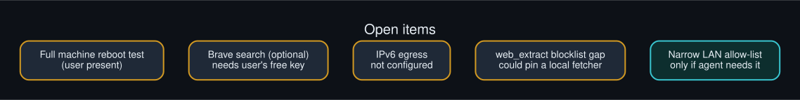

- Full machine reboot test (boot ordering, firewall loading at startup).
- Optional Brave search (free key from the user).
- IPv6 egress filtering (the sandbox network has no IPv6).
- `web_extract` is not covered by the blocklist; pin a local fetcher if that matters.

## Runbook and changelog

- [`RUNBOOK.md`](RUNBOOK.md): verify, recover and roll back, with commands.
- [`CHANGELOG.md`](CHANGELOG.md): dated list of every change.

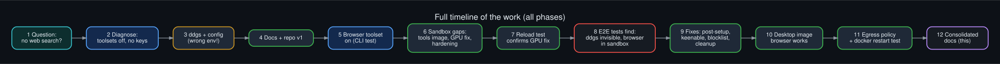

## Diagram index

All diagrams are Graphviz, dark themed, with `.dot` source, `.png` (160 dpi) and `.svg` in [`diagrams/`](diagrams/).
Re-render with `./render.sh`.

| # | Diagram |
|---|---|
| 01 | [Problem diagnosis](diagrams/01_problem_diagnosis.png) |
| 02 | [Toolset resolution](diagrams/02_toolset_resolution.png) |
| 03 | [Before / after config](diagrams/03_before_after_config.png) |
| 04 | [Request path](diagrams/04_request_path.png) |
| 05 | [Timeout isolation](diagrams/05_timeout_isolation.png) |
| 06 | [Python env gotcha](diagrams/06_python_env_gotcha.png) |
| 07 | [Backend options](diagrams/07_backend_options.png) |
| 08 | [Session timeline](diagrams/08_rollout_timeline.png) |
| 09 | [Sandbox boundary](diagrams/09_sandbox_boundary.png) |
| 10 | [Failure modes](diagrams/10_failure_modes.png) |
| 11 | [Verification flow](diagrams/11_verification_flow.png) |
| 12 | [Repo layout](diagrams/12_repo_layout.png) |
| 13 | [Browser access levels](diagrams/13_browser_access_levels.png) |
| 14 | [Browser stack](diagrams/14_browser_stack.png) |
| 15 | [Browser risk model](diagrams/15_browser_risk_model.png) |
| 16 | [Sandbox image layers](diagrams/16_sandbox_image_layers.png) |
| 17 | [Tool inventory](diagrams/17_tools_inventory.png) |
| 18 | [GPU failure root cause](diagrams/18_gpu_failure_root_cause.png) |
| 19 | [GPU fix flags](diagrams/19_gpu_fix_flags.png) |
| 20 | [Container recreation flow](diagrams/20_container_recreation_flow.png) |
| 21 | [Hardening matrix](diagrams/21_hardening_matrix.png) |
| 22 | [Mount blast radius](diagrams/22_mount_blast_radius.png) |
| 23 | [Verification ladder](diagrams/23_verification_ladder.png) |
| 24 | [System overview](diagrams/24_system_overview.png) |
| 25 | [Daemon-reload test](diagrams/25_reload_test.png) |
| 26 | [Search backend reality](diagrams/26_search_backend_reality.png) |
| 27 | [Extract path](diagrams/27_extract_path.png) |
| 28 | [Blocklist coverage](diagrams/28_blocklist_coverage.png) |
| 29 | [Browser mode decision](diagrams/29_browser_mode_decision.png) |
| 30 | [Cleanup before/after](diagrams/30_cleanup_before_after.png) |
| 31 | [Sandbox reachability](diagrams/31_sandbox_reachability.png) |
| 32 | [Egress options](diagrams/32_egress_options.png) |
| 33 | [Follow-up test ladder](diagrams/33_followup_test_ladder.png) |
| 34 | [Capability map](diagrams/34_capability_map.png) |
| 35 | [Desktop image layers](diagrams/35_desktop_image_layers.png) |
| 36 | [Desktop stack in sandbox](diagrams/36_desktop_stack.png) |
| 37 | [Browser verified flow](diagrams/37_browser_verified_flow.png) |
| 38 | [Desktop build context](diagrams/38_desktop_build_context.png) |
| 39 | [Egress network topology](diagrams/39_egress_network_topology.png) |
| 40 | [Egress rule chain](diagrams/40_egress_rule_chain.png) |
| 41 | [Egress before/after](diagrams/41_egress_before_after.png) |
| 42 | [Egress persistence and rollback](diagrams/42_egress_persistence_rollback.png) |
| 43 | [browser_console error root cause](diagrams/43_console_error_root_cause.png) |
| 44 | [Current state dashboard](diagrams/44_current_state_dashboard.png) |
| 45 | [Full session timeline](diagrams/45_session_timeline_full.png) |
| 46 | [Decision log](diagrams/46_decision_log.png) |
| 47 | [Lessons learned map](diagrams/47_lessons_learned_map.png) |
| 48 | [Evidence matrix](diagrams/48_evidence_matrix.png) |
| 49 | [Runbook flow](diagrams/49_runbook_flow.png) |
| 50 | [Config surface map](diagrams/50_config_surface_map.png) |
| 51 | [Risk register](diagrams/51_risk_register.png) |
| 52 | [Open items](diagrams/52_open_items_roadmap.png) |

## Repo layout


```
README.md        this file
SESSION.md       working log of the session
config-diff.md   exact config changes and rollback
RUNBOOK.md       verify / recover / roll back commands
CHANGELOG.md     dated list of changes
sandbox/         Dockerfile.tools, Dockerfile.desktop, egress/ (firewall script + systemd unit)
render.sh        re-render diagrams and logo
assets/          logo.svg / logo.png
diagrams/        *.dot *.png *.svg
LICENSE          MIT
```

## License
MIT. See [`LICENSE`](LICENSE).
