<div align="center">


# Giving Hermes Agent the web, plus a sturdier sandbox: DuckDuckGo search, headless browser, tools image, GPU fix


*A local Hermes agent said it had no web search. It was right. This repo documents why, the small
config change that fixed it without any paid service or API key, the follow-up that enabled a local
headless browser, and a sandbox upgrade (CLI toolbox image, durable GPU fix, hardening flags).*

</div>

---

## Table of contents
1. [TL;DR](#tldr)
2. [The question](#the-question)
3. [Diagnosis](#diagnosis)
4. [How toolsets resolve](#how-toolsets-resolve)
5. [The fix](#the-fix)
6. [Request path](#request-path)
7. [Gotchas](#gotchas)
8. [Limits](#limits)
9. [Alternatives](#alternatives)
10. [Verification status](#verification-status)
11. [Troubleshooting](#troubleshooting)
12. [Browser access](#browser-access)
13. [Sandbox upgrade](#sandbox-upgrade)
14. [Diagram index](#diagram-index)
15. [Repo layout](#repo-layout)

## TL;DR

| Step | What | Where |
|---|---|---|
| 1 | `pip install "ddgs==9.16.0"` | Hermes's **managed** Python 3.14.7 |
| 2 | Remove `web` (and `search`) from `agent.disabled_toolsets` | `~/.hermes/config.yaml` |
| 3 | Add `web` to `platform_toolsets.cli` | `~/.hermes/config.yaml` |
| 4 | Set `web.search_backend: ddgs` | `~/.hermes/config.yaml` |
| 5 | Restart the Hermes session and gateway if the tool is missing | shell |
| 6 | *(follow-up)* Enable the `browser` toolset | see [Browser access](#browser-access) |

No API key, no account, no cost. Exact diff: [`config-diff.md`](config-diff.md).

## The question

> "For the running hermes instance on this machine the agent reports that it doesn't have web search
> functionality/accessibility? Is that true?"

## Diagnosis

It was true, and it was a configuration state rather than a bug. Three independent things pointed the same way:

1. `agent.disabled_toolsets` listed `web`, `search`, `x_search` and `browser`.
2. `platform_toolsets.cli` was `file, skills, terminal, vision`, with no web entry.
3. Every search provider key in `~/.hermes/.env` (Exa, Parallel, Firecrawl) was a commented-out template line.

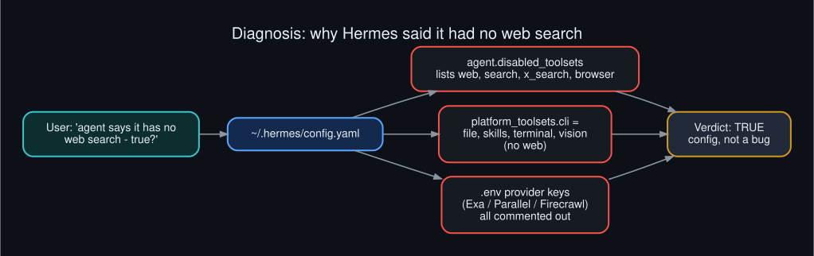

## How toolsets resolve

`disabled_toolsets` is a strict deny list: a toolset named there is subtracted from what the platform asks for,
so adding `web` to the CLI toolsets alone would not have been enough.

- `web` = `web_search` + `web_extract`
- `search` = `web_search` only

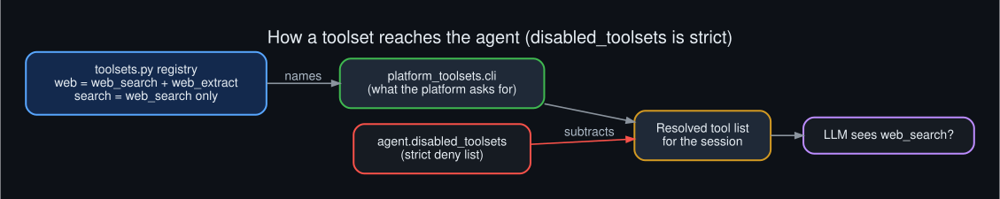

## The fix

Two changes: one package, one config edit.

```bash
# 1. install into the Python Hermes actually runs (see Gotchas)
~/.hermes/tools/python-3.14.7+20260901-linux-x64/bin/python3 -m pip install "ddgs==9.16.0"

# 2. back up, then edit config
cp ~/.hermes/config.yaml ~/.hermes/config.yaml.bak-$(date +%s)
```

```yaml
agent:
  disabled_toolsets:      # 'web' and 'search' removed from this list
    - x_search            # ...others unchanged
platform_toolsets:
  cli:
    - file
    - web                 # added
    - skills
    - terminal
    - vision
web:
  search_backend: ddgs    # added
```

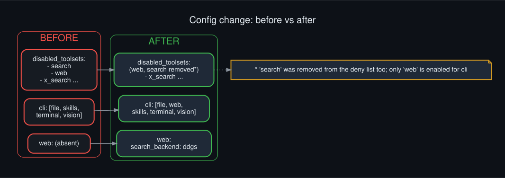

`hermes tools list` afterwards reports `web  Web Search & Scraping` as enabled.

## Request path

Hermes's `ddgs` plugin (`plugins/web/ddgs/provider.py`) does not call the library in-process. Each search
runs in a disposable child process that the parent polls, so a hung network call can be killed.

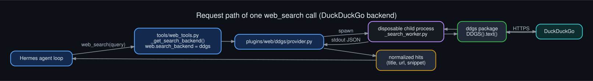

Per the plugin's own docstring, `ddgs`/`primp` can block inside native code while holding the GIL, which
makes a thread-pool timeout impossible to enforce and can freeze Ctrl+C. The parent therefore enforces a
30 second wall-clock cap and escalates `terminate()` to `kill()` after a one second grace period.

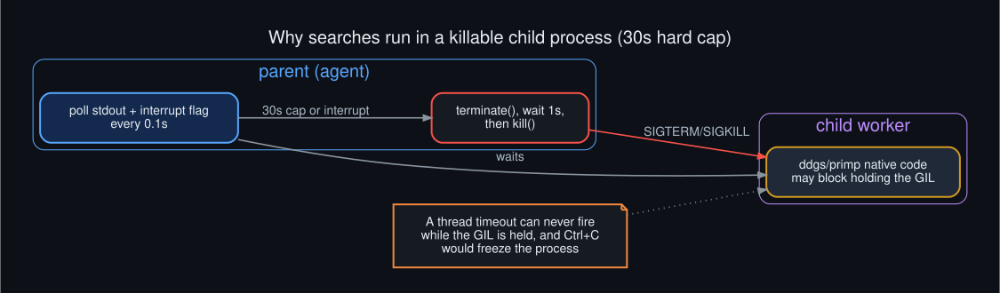

## Gotchas

**Install into the right Python.** The `hermes` launcher resolves to a managed runtime under
`~/.hermes/tools/python-3.14.7+.../`. The repo's `venv/` directory is not what runs.

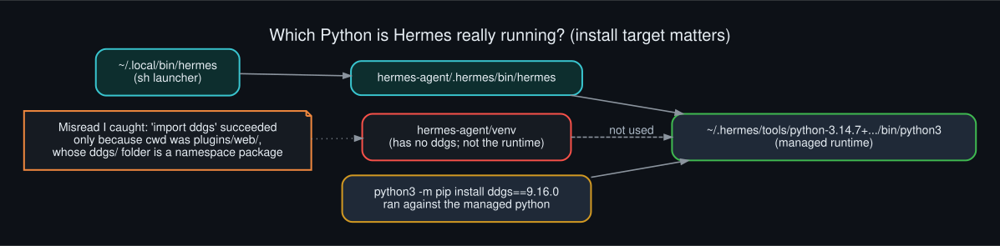

**A false positive while checking.** Running `import ddgs` from inside `hermes-agent/plugins/web/` appeared to
succeed, because the plugin directory named `ddgs/` is importable as a namespace package from that cwd. Always
test imports from a neutral directory such as `/tmp`.

**Searching vs. the sandbox.** Web search runs on the host side of the agent. The Docker sandbox
(`terminal.backend: docker`) is a separate boundary used by the `terminal` tool.

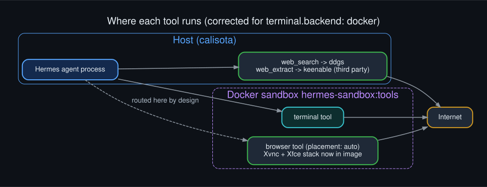

## Limits

- **Search only.** `ddgs` provides `web_search`. `web_extract` needs a different backend, so expect it to
  fail or be unavailable. The agent can still fetch pages with `curl` through the terminal tool.
- **Rate limits.** DuckDuckGo is accessed through an unofficial scraping library and may throttle heavy use. The 30 s cap keeps
  the agent loop from hanging.
- **Restart.** Not needed in practice: the operator confirmed search worked in the running instance. If a session lacks the tool, restart it.
- **Privacy.** Queries leave the machine to DuckDuckGo, unlike a self-hosted SearXNG.

## Alternatives

| Backend | Key? | Notes |
|---|---|---|
| `ddgs` | none | **chosen**; search only |
| `brave-free` | `BRAVE_SEARCH_API_KEY` | free signup at brave.com/search/api, about 2k queries/month per the plugin manifest |
| `searxng` | none (self-host) | most private; needs a SearXNG instance |
| Exa / Parallel / Firecrawl | API key | keyed vendors with extract support |

Switching is one line: `web.search_backend: brave-free` (plus the key in `~/.hermes/.env`).

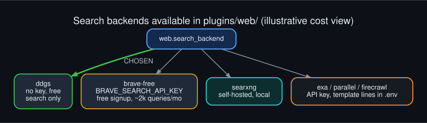

## Verification status

Honest accounting:

| Check | State |
|---|---|
| `DDGS().text()` live query from the managed Python returned results | done |
| `config.yaml` parses and shows the intended values | done |
| `hermes tools list` shows `web` enabled | done |
| Agent performs a real `web_search` end to end | **done**, confirmed independently by the operator; no reload was needed |

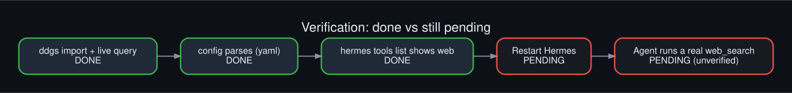
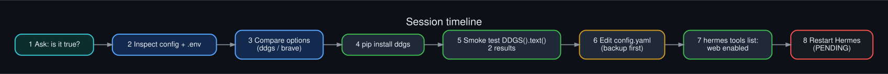

## Troubleshooting

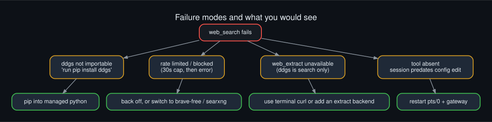

| Symptom | Likely cause | Fix |
|---|---|---|
| Agent still says no web search | session predates the edit (not observed here) | restart session and gateway |
| `ddgs package is not installed` | installed into the wrong Python | pip into the managed runtime |
| Timeouts or empty results | rate limiting | wait, or switch backend |
| `web_extract` errors | search-only backend | use `curl`, or add an extract backend |

## Browser access

Follow-up request: "how can we give our hermes agent instance full browser access?"

Hermes already had a local browser installed (`~/.hermes/tools/chromium-1208`, driven by the
`agent-browser` 0.26.0 Node CLI under `~/.hermes/tools/agent-browser-0.26.0-linux-x64`). The `browser`
toolset was simply disabled. Four levels of access exist:

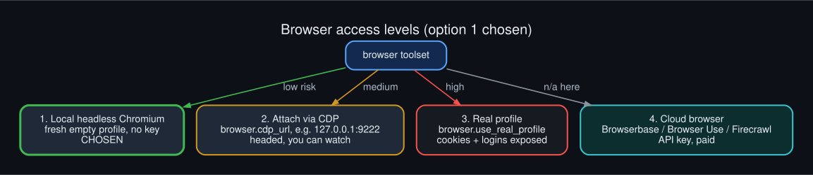

| Level | Mechanism | Risk |
|---|---|---|
| **1. Local headless Chromium (chosen)** | enable the `browser` toolset; fresh empty profile | low |
| 2. Attach via CDP | `browser.cdp_url: http://127.0.0.1:9222`, Chrome started with `--remote-debugging-port=9222` | medium |
| 3. Real profile | `browser.use_real_profile` (consent-gated) exposes cookies and logins | high |
| 4. Cloud browser | Browserbase / Browser Use / Firecrawl, API key and cost | n/a |

### Change made (level 1)

```yaml
agent:
  disabled_toolsets:      # 'browser' removed from this list
platform_toolsets:
  cli:
    - file
    - web
    - browser             # added
    - skills
    - terminal
    - vision
```

`hermes tools list` then reports `browser  Browser Automation` as enabled.

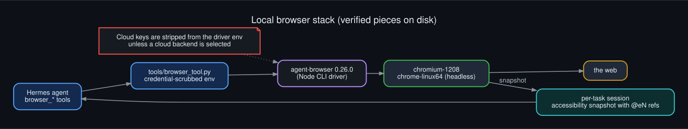

### Smoke test

Run directly against the bundled driver, outside Hermes's agent loop:

```bash
export AGENT_BROWSER_EXECUTABLE_PATH=~/.hermes/tools/chromium-1208/chrome-linux64/chrome
agent-browser-linux-x64 --session smoke open https://example.com   # prints the page title
agent-browser-linux-x64 --session smoke snapshot                   # accessibility tree
agent-browser-linux-x64 --session smoke close
```

It opened the page, returned a snapshot and closed cleanly. **Not yet verified:** the agent itself driving
the browser through its `browser_*` tools, and whether an already-running session picks up the toolset
without a restart.

### Risk model

The browser runs on the host, not inside the Docker sandbox, and a local model reading arbitrary pages can be
prompt-injected. Level 1 keeps this small: an empty profile means no cookies or logins to steal. The
driver environment is credential-scrubbed (cloud keys are only passed through when a cloud backend is used).
Avoid level 3 unless there is a specific need. The diagram below is illustrative, not a threat model.

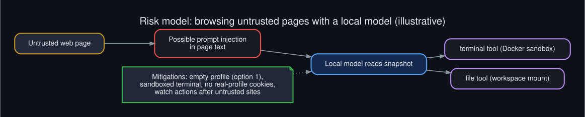

## Sandbox upgrade

Follow-up question: "what else might our hermes agent docker instance need?" A read-only survey of the
sandbox container (`hermes-5da4a7d0`, image `hermes-sandbox:pdf`) found three things worth fixing.

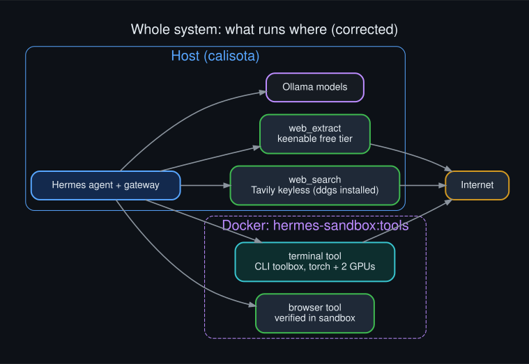

Web search and the browser tool run on the host; only the `terminal` tool runs in Docker.

### 1. CLI toolbox image

Missing from the image: `jq`, `ripgrep`, `tmux`, `sqlite3`, `zip`, `rsync`, `ffmpeg`, `pandoc`, `gh`.
They are now baked into a new image layer, [`sandbox/Dockerfile.tools`](sandbox/Dockerfile.tools), so they survive
container recreation (ad-hoc installs into a running container do not).

```bash
docker build -t hermes-sandbox:tools -f Dockerfile.tools .   # then terminal.docker_image: hermes-sandbox:tools
```

`libreoffice` and `chromium` were skipped on purpose, since the browser tool runs on the host.

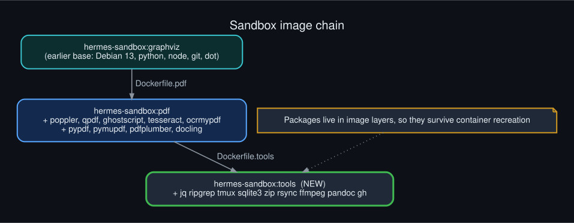
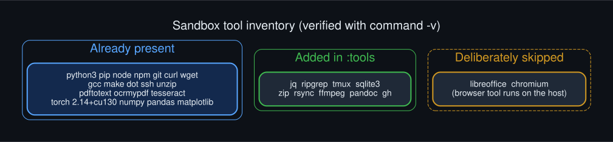

### 2. GPU silently dead inside the long-running container

Symptom: `nvidia-smi` printed `Failed to initialize NVML: Unknown Error` and `torch.cuda.is_available()` was
`False`, although `--gpus=all` was configured and `/dev/nvidia*` nodes existed. A **fresh** container with
`--gpus=all` worked (2 GPUs, CUDA True), so the host setup was fine. Docker here uses the systemd cgroup driver
(cgroup v2) and two systemd reloads had happened since the container started, which is the known way to lose
device access. The cause was then **confirmed by reproduction**: a control container started with `--gpus=all` only lost the GPU
(same NVML Unknown Error) immediately after one `sudo systemctl daemon-reload`.

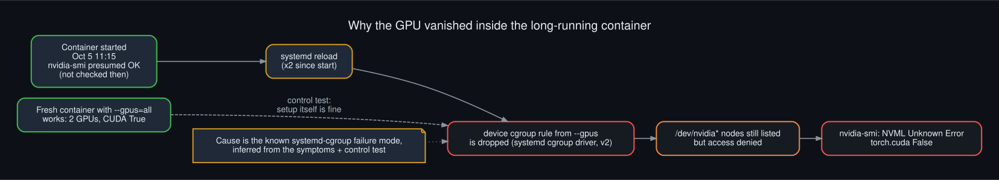

Fix: keep `--gpus=all` and also pass explicit device flags so the access is part of the container's own config:

```yaml
terminal:
  docker_extra_args:
    - --gpus=all
    - --device=/dev/nvidia0
    - --device=/dev/nvidia1
    - --device=/dev/nvidiactl
    - --device=/dev/nvidia-uvm
    - --device=/dev/nvidia-uvm-tools
```

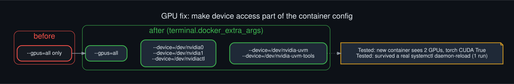

**Tested across a reload:** with the sandbox and a `--gpus=all`-only control container both running, one
`sudo systemctl daemon-reload` left the sandbox with both GPUs and torch CUDA True, while the control lost the GPU
(`Failed to initialize NVML: Unknown Error`). One reload, one run; it is a single observation, not a soak test.

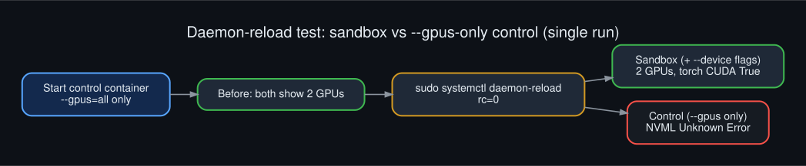

### 3. Hardening

| Control | State |
|---|---|
| cap-drop ALL, non-root uid 1000, 4 GB / 2 CPU | already on |
| `--security-opt=no-new-privileges` | **added** (Hermes also sets it, so it appears twice; harmless) |
| `--pids-limit=512` | **added** |
| network egress | left open (web and curl are wanted) |
| rw mounts of `/workspace` and `sandbox_ssh` | left as is: this is the real blast radius |
| writable rootfs, runc runtime | left as is |

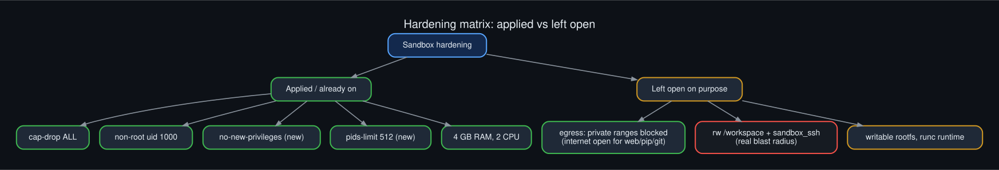
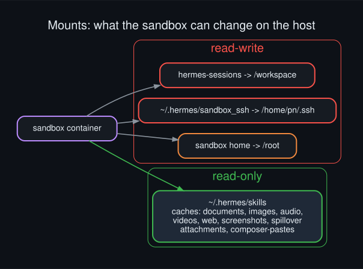

### Applying it: recreating the container

The old container was stopped and removed; Hermes recreated it from config on its next terminal call.
Everything was dry-run first with a throwaway `docker run` using the same flags.

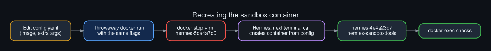

### Verification, and a warning about self-reports

Checked with `docker exec` and `docker inspect` on the new container: both GPUs listed, torch CUDA True,
`jq 1.7`, `ripgrep 14.1.1`, `/workspace` writable, PidsLimit 512, no-new-privileges set, 5 device nodes.

A first check through `hermes chat -q` made **zero tool calls** and returned invented output (for example
`jq 1.7.1` and `Total GPUs: 1`). It was discarded. A retry with `-t terminal` made real calls. Verify with
Docker, not the model's own report.

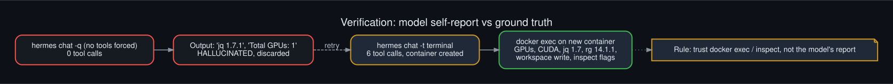

## Diagram index

All diagrams are Graphviz, dark themed, with `.dot` source, `.png` (160 dpi) and `.svg` in [`diagrams/`](diagrams/).
Re-render with `./render.sh`.

| # | Diagram |
|---|---|
| 01 | [Problem diagnosis](diagrams/01_problem_diagnosis.png) |
| 02 | [Toolset resolution](diagrams/02_toolset_resolution.png) |
| 03 | [Before / after config](diagrams/03_before_after_config.png) |
| 04 | [Request path](diagrams/04_request_path.png) |
| 05 | [Timeout isolation](diagrams/05_timeout_isolation.png) |
| 06 | [Python env gotcha](diagrams/06_python_env_gotcha.png) |
| 07 | [Backend options](diagrams/07_backend_options.png) |
| 08 | [Session timeline](diagrams/08_rollout_timeline.png) |
| 09 | [Sandbox boundary](diagrams/09_sandbox_boundary.png) |
| 10 | [Failure modes](diagrams/10_failure_modes.png) |
| 11 | [Verification flow](diagrams/11_verification_flow.png) |
| 12 | [Repo layout](diagrams/12_repo_layout.png) |
| 13 | [Browser access levels](diagrams/13_browser_access_levels.png) |
| 14 | [Browser stack](diagrams/14_browser_stack.png) |
| 15 | [Browser risk model](diagrams/15_browser_risk_model.png) |
| 16 | [Sandbox image layers](diagrams/16_sandbox_image_layers.png) |
| 17 | [Tool inventory](diagrams/17_tools_inventory.png) |
| 18 | [GPU failure root cause](diagrams/18_gpu_failure_root_cause.png) |
| 19 | [GPU fix flags](diagrams/19_gpu_fix_flags.png) |
| 20 | [Container recreation flow](diagrams/20_container_recreation_flow.png) |
| 21 | [Hardening matrix](diagrams/21_hardening_matrix.png) |
| 22 | [Mount blast radius](diagrams/22_mount_blast_radius.png) |
| 23 | [Verification ladder](diagrams/23_verification_ladder.png) |
| 24 | [System overview](diagrams/24_system_overview.png) |
| 25 | [Daemon-reload test](diagrams/25_reload_test.png) |

## Repo layout

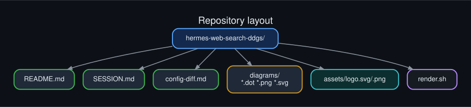

```
README.md        this file
SESSION.md       working log of the session
config-diff.md   exact config changes and rollback
sandbox/         Dockerfile.tools (toolbox image)
render.sh        re-render diagrams and logo
assets/          logo.svg / logo.png
diagrams/        *.dot *.png *.svg
LICENSE          MIT
```

## License
MIT. See [`LICENSE`](LICENSE).
